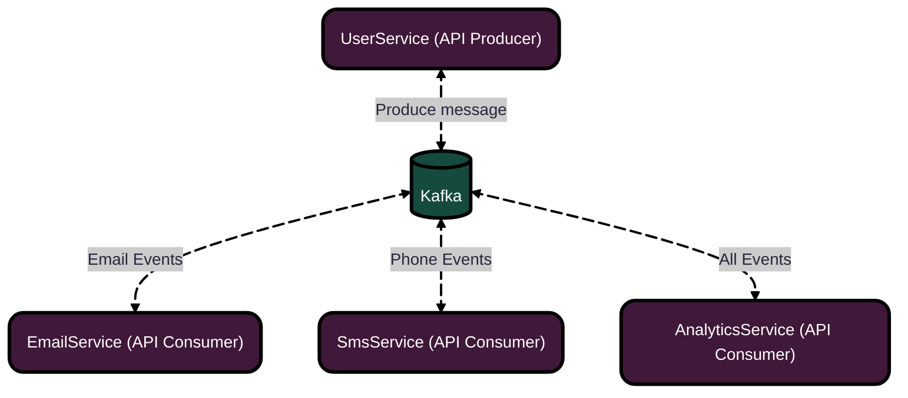
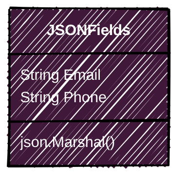

<p aligm="center">
    <h1 align="center">
        Микросервисная система уведомлений
    </h1>
    <h4 align="center">
        Современная масштабируемая система уведомлений, построенная на микросервисах Go и Apache Kafka. Система обрабатывает регистрации пользователей и отправляет уведомления через несколько каналов (Email, SMS) асинхронно.
    </h4>
</p>


###  Ключевые возможности

- **Асинхронная обработка** - Неблокирующая обработка запросов через Kafka
- **Многоканальные уведомления** - Поддержка Email и SMS рассылок
- **Высокая масштабируемость** - Горизонтальное масштабирование каждого сервиса
- **Отказоустойчивость** - Автоматическое восстановление при сбоях
- **Мониторинг и аналитика** - Встроенная система сбора метрик

<p align="center"> 
    <h3 align="center">Архитектура проекта</h3>
</p>



<p align="center">
    <h3 align="center">
        Компоненты системы
    </h3>
</p>

| &nbsp;&nbsp;&nbsp;&nbsp;&nbsp;&nbsp;&nbsp;&nbsp;&nbsp;&nbsp;&nbsp;&nbsp; Сервис &nbsp;&nbsp;&nbsp;&nbsp;&nbsp;&nbsp;&nbsp;&nbsp;&nbsp;&nbsp;&nbsp;&nbsp; | &nbsp;&nbsp;&nbsp;&nbsp;&nbsp;&nbsp;&nbsp;&nbsp;&nbsp;&nbsp;&nbsp;&nbsp;&nbsp;&nbsp;&nbsp;&nbsp;&nbsp;&nbsp;&nbsp;&nbsp;&nbsp;&nbsp;&nbsp;&nbsp;&nbsp;&nbsp;&nbsp;&nbsp;&nbsp;&nbsp;&nbsp;&nbsp;&nbsp;&nbsp;&nbsp;&nbsp;&nbsp;&nbsp;&nbsp;&nbsp;&nbsp;&nbsp;&nbsp;&nbsp;&nbsp;&nbsp;&nbsp;&nbsp;&nbsp;&nbsp;&nbsp;&nbsp;&nbsp;&nbsp;&nbsp;&nbsp;&nbsp;&nbsp;&nbsp;&nbsp;&nbsp;&nbsp;&nbsp;&nbsp;&nbsp;Информация  &nbsp;&nbsp;&nbsp;&nbsp;&nbsp;&nbsp;&nbsp;&nbsp;&nbsp;&nbsp;&nbsp;&nbsp;&nbsp;&nbsp;&nbsp;&nbsp;&nbsp;&nbsp;&nbsp;&nbsp;&nbsp;&nbsp;&nbsp;&nbsp;&nbsp;&nbsp;&nbsp;&nbsp;&nbsp;&nbsp;&nbsp;&nbsp;&nbsp;&nbsp;&nbsp;&nbsp;&nbsp;&nbsp;&nbsp;&nbsp;&nbsp;&nbsp;&nbsp;&nbsp;&nbsp;&nbsp;&nbsp;&nbsp;&nbsp;&nbsp;&nbsp;&nbsp;&nbsp;&nbsp;&nbsp;&nbsp;&nbsp;&nbsp;&nbsp;&nbsp;&nbsp;&nbsp;&nbsp;&nbsp;&nbsp;|
|:-------|:-----------|
| &nbsp;&nbsp;&nbsp;&nbsp;&nbsp;&nbsp;&nbsp;&nbsp;**UserService** | &nbsp;&nbsp;&nbsp;&nbsp;&nbsp;&nbsp;&nbsp;&nbsp;&nbsp;&nbsp;&nbsp;&nbsp;&nbsp;&nbsp;&nbsp;&nbsp;&nbsp;&nbsp;&nbsp;&nbsp;&nbsp;&nbsp;&nbsp;&nbsp;&nbsp;&nbsp;&nbsp;&nbsp;&nbsp;&nbsp;&nbsp;&nbsp;&nbsp;&nbsp;&nbsp;&nbsp;&nbsp;&nbsp;&nbsp;&nbsp;Генерирует события пользователей |
| &nbsp;&nbsp;&nbsp;&nbsp;&nbsp;&nbsp;&nbsp;&nbsp;&nbsp;&nbsp;&nbsp;&nbsp;&nbsp;**Kafka** | &nbsp;&nbsp;&nbsp;&nbsp;&nbsp;&nbsp;&nbsp;&nbsp;&nbsp;&nbsp;&nbsp;&nbsp;&nbsp;&nbsp;&nbsp;&nbsp;&nbsp;&nbsp;&nbsp;&nbsp;&nbsp;&nbsp;&nbsp;&nbsp;&nbsp;&nbsp;&nbsp;&nbsp;&nbsp;&nbsp;&nbsp;&nbsp;&nbsp;&nbsp;&nbsp;&nbsp;&nbsp;&nbsp;&nbsp;&nbsp;&nbsp;&nbsp;&nbsp;&nbsp;&nbsp;&nbsp;&nbsp;&nbsp;&nbsp;&nbsp;&nbsp;&nbsp;&nbsp;&nbsp;&nbsp;Брокер сообщений |
| &nbsp;&nbsp;&nbsp;&nbsp;&nbsp;&nbsp;&nbsp;**EmailService** | &nbsp;&nbsp;&nbsp;&nbsp;&nbsp;&nbsp;&nbsp;&nbsp;&nbsp;&nbsp;&nbsp;&nbsp;&nbsp;&nbsp;&nbsp;&nbsp;&nbsp;&nbsp;&nbsp;&nbsp;&nbsp;&nbsp;&nbsp;&nbsp;&nbsp;&nbsp;&nbsp;&nbsp;&nbsp;&nbsp;&nbsp;&nbsp;&nbsp;&nbsp;&nbsp;&nbsp;&nbsp;&nbsp;&nbsp;&nbsp;&nbsp;&nbsp;&nbsp;&nbsp;&nbsp;Обрабатывает email-события |
| &nbsp;&nbsp;&nbsp;&nbsp;&nbsp;&nbsp;&nbsp;&nbsp;**SmsService** | &nbsp;&nbsp;&nbsp;&nbsp;&nbsp;&nbsp;&nbsp;&nbsp;&nbsp;&nbsp;&nbsp;&nbsp;&nbsp;&nbsp;&nbsp;&nbsp;&nbsp;&nbsp;&nbsp;&nbsp;&nbsp;&nbsp;&nbsp;&nbsp;&nbsp;&nbsp;&nbsp;&nbsp;&nbsp;&nbsp;&nbsp;&nbsp;&nbsp;&nbsp;&nbsp;&nbsp;&nbsp;&nbsp;&nbsp;&nbsp;&nbsp;&nbsp;&nbsp;&nbsp;&nbsp;&nbsp;Обрабатывает SMS-события |
| &nbsp;&nbsp;&nbsp;&nbsp;**AnalyticsService** | &nbsp;&nbsp;&nbsp;&nbsp;&nbsp;&nbsp;&nbsp;&nbsp;&nbsp;&nbsp;&nbsp;&nbsp;&nbsp;&nbsp;&nbsp;&nbsp;&nbsp;&nbsp;&nbsp;&nbsp;&nbsp;&nbsp;&nbsp;&nbsp;&nbsp;&nbsp;&nbsp;&nbsp;&nbsp;&nbsp;&nbsp;&nbsp;&nbsp;&nbsp;&nbsp;&nbsp;&nbsp;&nbsp;&nbsp;&nbsp;&nbsp;&nbsp;&nbsp;&nbsp;&nbsp;&nbsp;&nbsp;&nbsp;&nbsp;&nbsp;Анализирует все события 


#### User Service
- **Назначение**: Прием HTTP запросов и генерация событий
- **Функции**:
  - Валидация входящих данных
  - Генерация уникальных ID пользователей
  - Публикация событий в Kafka
- **API endpoints**:
  - `POST /register` - Регистрация пользователя

#### Email Service
- **Назначение**: Отправка email уведомлений
- **Особенности**:
  - Асинхронная обработка очереди
 
#### SMS Service  
- **Назначение**: Отправка SMS сообщений
- **Особенности**:
    - Асинхронная обработка очереди

#### Analytics Service
- **Назначение**: Сбор и анализ метрик
- **Функции**:
  - Мониторинг доставки уведомлений


#### Apache Kafka
- **Роль**: Центральный message broker
- **Топики**:
  - `user-events` - События пользователей
  - `notification-events` - Уведомления
  - `analytics-events` - Аналитические события

<p align="center">
    <h3 align="center">
        API endpoint
    </h3>
    <h4 align="center">
        User Service
    </h4>
    <h4>
       JSON Post request (/register):
    </h4>




</p>

<p>
	<h4>
		JSON Answer:
	</h4>
	
```mermaid
 ---
config:
  look: handDrawn
  theme: dark
  layout: dagre
---
classDiagram
direction TB
    class JSONFields {
	    String status
	    String user_id
      json.Unmarshal()
    }
	class JSONFields:::JSON_FIEDLS
	classDef JSON_FIEDLS :,stroke-width:2px, stroke-dasharray: 0, fill:#401839, color:#FFFFFF, stroke:#000000
 ```
</p>

<p>
	<h3 align="center">
		Сборка и запуск
	</h3>
	
```makefile
all:

build:
	docker-compose build

up:
	docker-compose up

down:
	docker-compose down

logs:
	docker-compose logs -f sms-service user-service email-service analytics-service

request:
	curl -X POST http://localhost:8080/register -H "Content-Type: application/json" -d '{"email": "test@example.com", "phone": "+1234567890"}'
```

```go
make build - Собирает все Docker образы для сервисов
make up - Запускает всю систему
make down - Останавливает и удаляет все контейнеры
make logs - Показывает логи в реальном времени 
make request - Отправляет тестовый запрос на сервис
```
</p>

